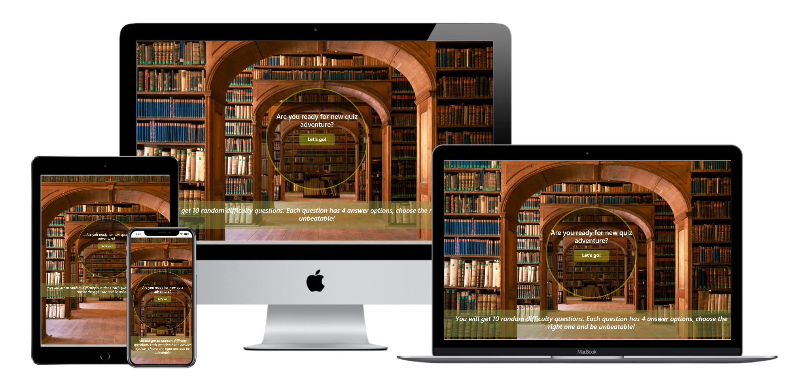
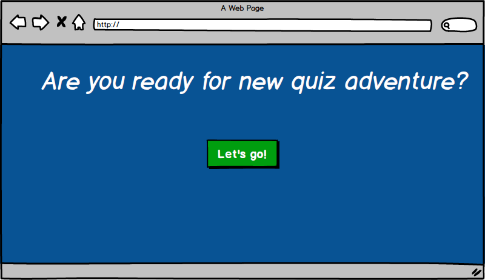
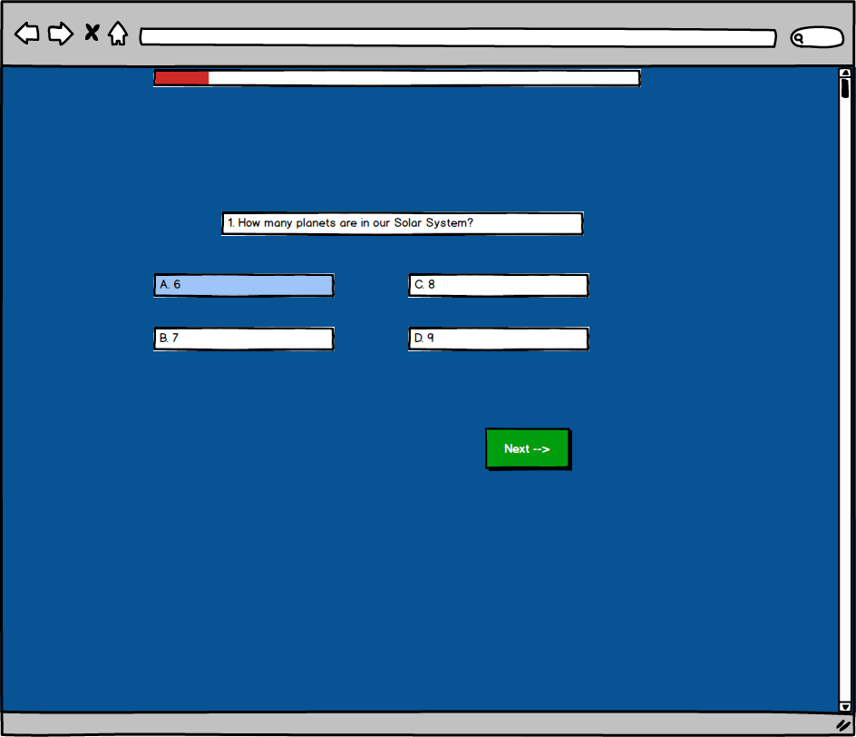
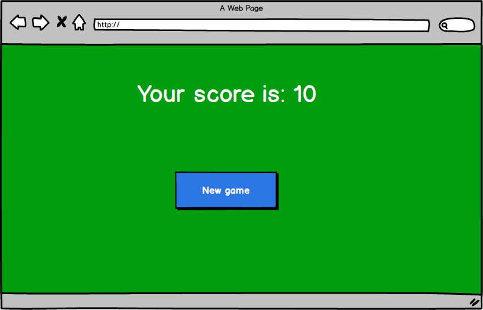
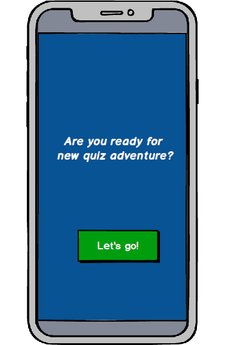
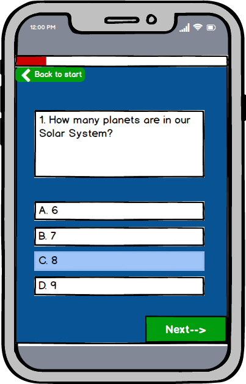
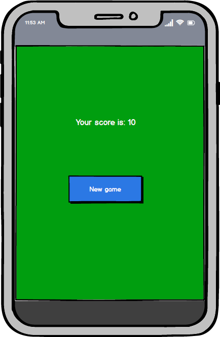

# Trivia Quiz

## [View the live project here.](https://miss-monkey.github.io/quiz/.)

## [Link to GitHub repository.](https://github.com/miss-monkey/quiz)

For my Frontend Development milestone project I have created Trivia Quiz.
The website has home page where user can see short description of how to play, quiz page where all questions are fetched from public api and score page where user can see results.
This quiz has 10 random general knowledge questions. Each question has 4 answer options. For each correct choice player gets 1 point.
 
## UX
 
Homepage has library background which is inspiring to play. For quiz I used tenne, olive green, yellow, grey colors as they perfectly match together.
Quiz has "End Game" and "Home" buttons so user can end the game or start it over at any time.

### User Stories
For user stories I asked my friends' who are real quiz fans opinion.

- As a user, I want game instructions to be displayed, so that I can understand game before I start.
- As a user, I want easy navigation, so that I can end or start over the game at any time.
- As a user, I want to see correct answer after my choice.
- As a user, I want to see how many questions are answered and how many are left.
- As a user, I want to see my score at the end.

### Wireframes 
I used Balsamiq to design my project.

## Features
 
### Existing Features

#### Home Page
- The home page has background of library which is inspiring.
- Short game description.

#### Quiz Page
- Quiz has progress bar where user can see how many questions are answered.
- "End Game" and "Home" buttons allows user to easily navigate through the page.
- Each answer choice has color class which activates when pressed. Color green means choice is correct, red means answer is incorrect.

#### Score Page
- Score page allows users to see their score and start a new game if they wish to.

### Features Left to Implement
- Three difficulty choices in the front page, so that user can choose easy, medium or hard difficulty.
- Timer.
- Save results and create leaderboard.

## Technologies Used

In this section, you should mention all of the languages, frameworks, libraries, and any other tools that you have used to construct this project. For each, provide its name, a link to its official site and a short sentence of why it was used.
- [Balsamiq](https://balsamiq.com/) to create design wireframes.
- [HTML](https://en.wikipedia.org/wiki/HTML5) to structure page.
- [Font Awsome](https://fontawesome.com/) used icons to add more style.
- [CSS](https://en.wikipedia.org/wiki/CSS) to style content.
- [Bootstrap](https://getbootstrap.com/) for easier styling
- [Javascript](https://en.wikipedia.org/wiki/JavaScript) to add interactivity and fetch questions data from open Trivia database.
- [JQuery](https://jquery.com) to simplify DOM manipulation.
- [GitHub](https://github.com/) to host the project.
- [GitPod](https://gitpod.io/) for project development.

## Testing

Manual tests have been done during page development.
Used W3C Validator and no errors were found.

Page works fine on all screen sizes. 

### Desktop Testing

No issues were found using Microsoft Edge, Opera, Google Crome. On Firefox web browser radio button circles are still visible but it doesn't affect the game.

### Mobile Testing

No issues were found on mobile phones. 

### User Stories
#### Improved
- As a user, I want game instructions to be displayed, so that I can understand game before I start.
    - Short instructions are displayed in home page.

- As a user, I want easy navigation, so that I can end or start over the game at any time.
    - Page has "End Game" and "Home" buttons.

- As a user, I want to see how many questions are answered and how many are left.
    - Quiz has status bar.
- As a user, I want to see my score at the end.
    - When quiz is completed "See your score" button appears, which leads to the score page.

#### Left to Improved
- As a user, I want to see correct answer after my choice.

## Deployment

### GitHub Pages
The project was deployed to GitHub Pages using the following steps:

1. Log in to GitHub and locate the GitHub Repository
2. At the top of the Repository (not top of page), locate the "Settings" Button on the menu.
3. Scroll down the Settings page until you locate the "GitHub Pages" Section.
4. Under "Source", click the dropdown called "None" and select "Master Branch".
5. The page will automatically refresh.
6. Scroll back down through the page to locate the now published site link in the "GitHub Pages" section.

### Forking the GitHub Repository
By forking the GitHub Repository we make a copy of the original repository on our GitHub account to view and/or make changes without affecting the original repository by using the following steps:

1. Log in to GitHub and locate the GitHub Repository
2. At the top of the Repository (not top of page) just above the "Settings" Button on the menu, locate the "Fork" Button.

## Credits

### Content
- All quiz questions and answers are fetched from [Open Trivia Database](https://opentdb.com/)
- The idea for JavaScript code was from video tutorial by [Benjamin Siegel](https://www.youtube.com/watch?v=SgJ_femmsfg)

### Media
- The background photo used in this site was obtained from [Pinterest](https://www.pinterest.co.uk/)

### Acknowledgements

I received inspiration for this project from my friends and partner who love quizzes.

#### I'd like to thank:
- Medale Oluwafemi for precious mentoring.
- The Code Institute tutor support for help and advises.
- Slack community
- Stack overflow, where I found a lot of good information.